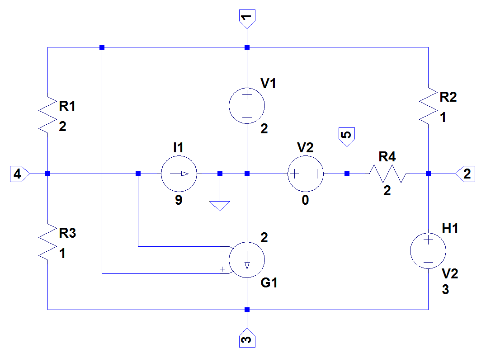

# SymMNA
SymMNA is a Python module that will generate a system of equations from a circuit’s netlist using Modified Nodal Analysis (MNA).

## Overview and Usage
Consider the schematic of the circuit shown below. This circuit has nine branches and five nodes. There are four resistors, two independent voltage sources and one independent current source. Additionally there is one VCCS and one CCVS. Each of the nodes is labeled along with the ground node.



The circuit was drawn with LTSpice and the netlist can be copied and pasted into the code snippet below.

```{python}
net_list = '''
R1 1 4 2
R2 1 2 1
R3 4 3 1
R4 2 5 2
V1 1 0 2
I1 4 0 9
H1 2 3 V2 3
G1 0 3 1 4 2
V2 0 5 0
'''

# generate the network equations from the netlist
report, network_df, i_unk_df, A, X, Z = SymMNA.smna(net_list)

# Put matrices into SymPy 
X = Matrix(X)
Z = Matrix(Z)

# formulate the equations
NE_sym = Eq(A*X,Z)

# generate markdown to display the equations
temp = ''
for i in range(len(X)):
    temp += '${:s}$<br>'.format(latex(Eq((A*X)[i:i+1][0],Z[i])))

Markdown(temp)
```

The following equations were automatically generated.

$I_{V1} + v_{1} \\cdot \\left(\\frac{1}{R_{2}} + \\frac{1}{R_{1}}\\right) - \\frac{v_{2}}{R_{2}} - \\frac{v_{4}}{R_{1}} = 0$<br>$I_{H1} + v_{2} \\cdot \\left(\\frac{1}{R_{4}} + \\frac{1}{R_{2}}\\right) - \\frac{v_{5}}{R_{4}} - \\frac{v_{1}}{R_{2}} = 0$<br>$- I_{H1} - g_{1} v_{1} + v_{4} \\left(g_{1} - \\frac{1}{R_{3}}\\right) + \\frac{v_{3}}{R_{3}} = 0$<br>$v_{4} \\cdot \\left(\\frac{1}{R_{3}} + \\frac{1}{R_{1}}\\right) - \\frac{v_{3}}{R_{3}} - \\frac{v_{1}}{R_{1}} = - I_{1}$<br>$- I_{V2} - \\frac{v_{2}}{R_{4}} + \\frac{v_{5}}{R_{4}} = 0$<br>$v_{1} = V_{1}$<br>$- v_{5} = V_{2}$<br>$- I_{V2} h_{1} + v_{2} - v_{3} = 0$

From here, SymPy, NumPy and SciPy are used to solve the equations and perform additional calculations.

## Examples and Documentation
Additional examples and documentation can be found here:

- [Symbolic Modified Nodal Analysis using Python](https://tiburonboy.github.io/Symbolic-Modified-Nodal-Analysis-using-Python/index.html) for an HTML book. 
- [SymMNA_demo.ipynb](https://github.com/Tiburonboy/SymMNA/blob/main/SymMNA_demo.ipynb) for a JupyterLab example.

## License
This work (includes python code, documentation, test circuits, etc.) is licensed under a [Creative Commons Attribution-ShareAlike 4.0 International License](https://creativecommons.org/licenses/by-sa/4.0/).  

- Share — Copy and redistribute the material in any medium or format.  
- Adapt — Remix, transform, and build upon the material for any purpose, even commercially.  
- Attribution — You must give [appropriate credit](https://creativecommons.org/licenses/by-sa/4.0/#ref-appropriate-credit), provide a link to the license, and [indicate if changes were made](https://creativecommons.org/licenses/by-sa/4.0/#ref-indicate-changes). You may do so in any reasonable manner, but not in any way that suggests the licensor endorses you or your use.  
- ShareAlike — If you remix, transform, or build upon the material, you must distribute your contributions under the [same license](https://creativecommons.org/licenses/by-sa/4.0/#ref-same-license) as the original.  


